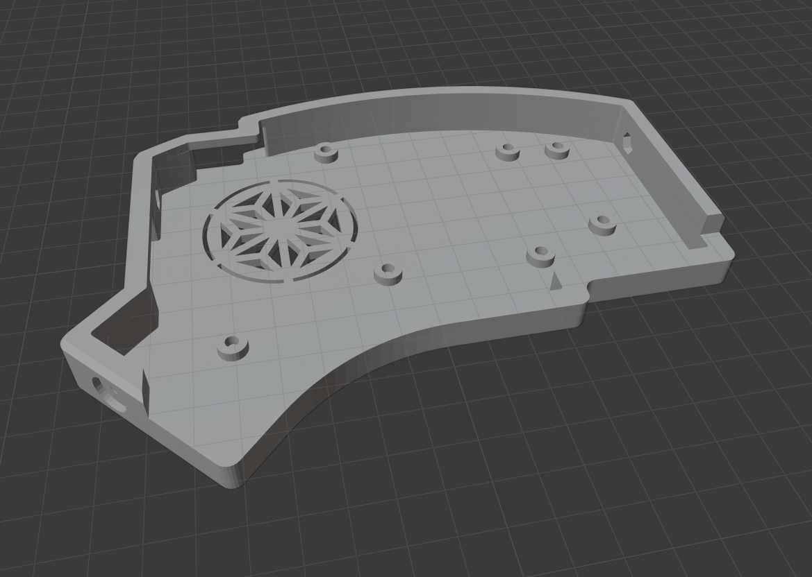
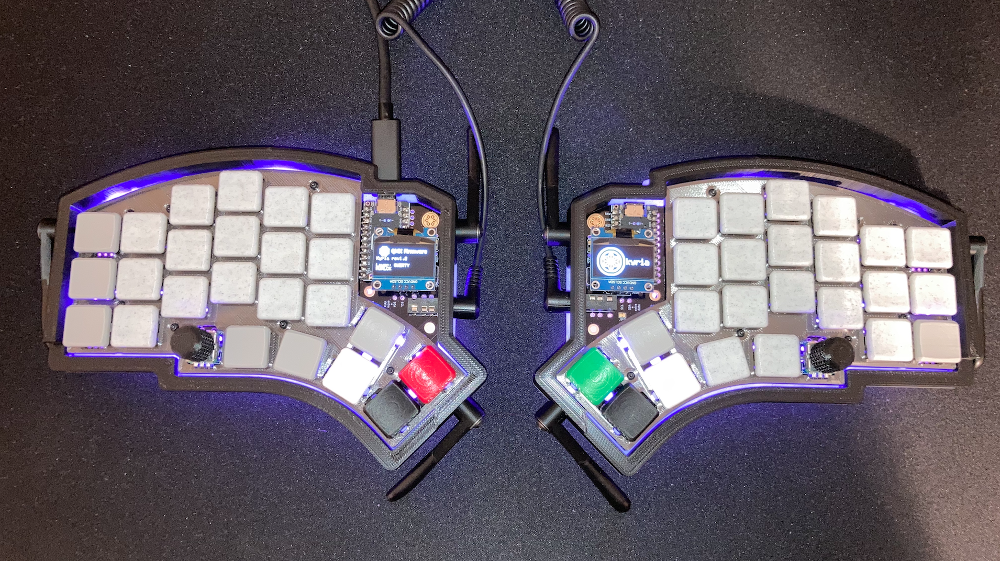
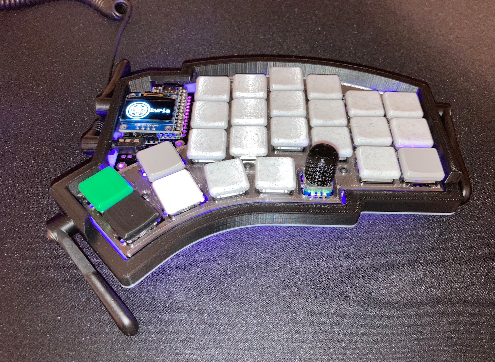

Kyria 3D Printed Low Profile Tent Case
========================

This is a 3D printed tent case for the Kyria, compatible with revision 0.7 and up. It is a modification of the regular 3D case that is compatible with print-able legs (taken from [wizarddata](https://github.com/wizarddata)'s fantastic [Iris case](https://github.com/wizarddata/Iris-Case/tree/master/High%20Profile)) as well as the [Ergodox tenting legs](https://ergodox-ez.com/products/tilt-tent-kit). This revision adds a low-profile front edge, helpful when using low profile switches like Choc's (especially with MBK-style keycaps).

To make a case, you'll need to print:

- left_tent_case.stl
- right_tent_case.stl
- 6x tent_leg.stl

Furthermore, you'll need:

- 14 of M2 x 10mm machine screws
- 14 of M2 tapered heat-set inserts *(the ones used in the example photos for the regular 3D printed case [Link](https://www.mcmaster.com/94180A312))*
- 6 of M3 x 16mm bolts (I recommend thumb screws)
- 6 of M3 hex nuts
- 2 x switch plates

This case is designed to work with the same sized plate as the one in the "Plate Case". A STL to 3D print a plate is provided in the case files, but a laser cut metal or acrylic plate can also be used (for this, use the "switch_plate.svg" or "switch_plate.dxf" files).

## Assembly

- Heat-set inserts should be slowly pressed into each "pillar" with the tip of a soldering iron set at the same temperature as your 3D printer nozzle temperature.
- Plate/PCB are mounted to the case body with screws going through both Plate and PCB, tightening onto the top of the switch plate to hold it firmly into the case. **Screws should be firm but not overtightened**
- Attach the tenting legs using the M3 bolts and M3 hex nuts.

## Build Photos

*Case Designed 2020 by Stephen Onnen*

*Tenting Modifications 2020 by John Helveston*
