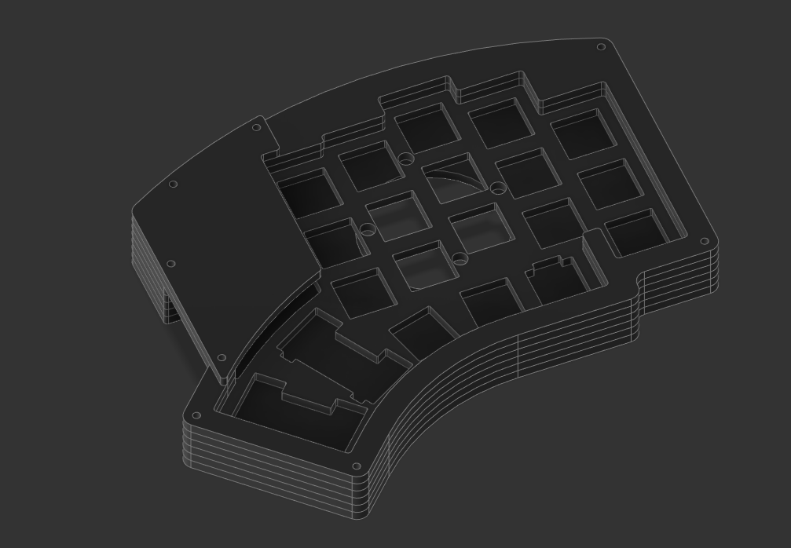
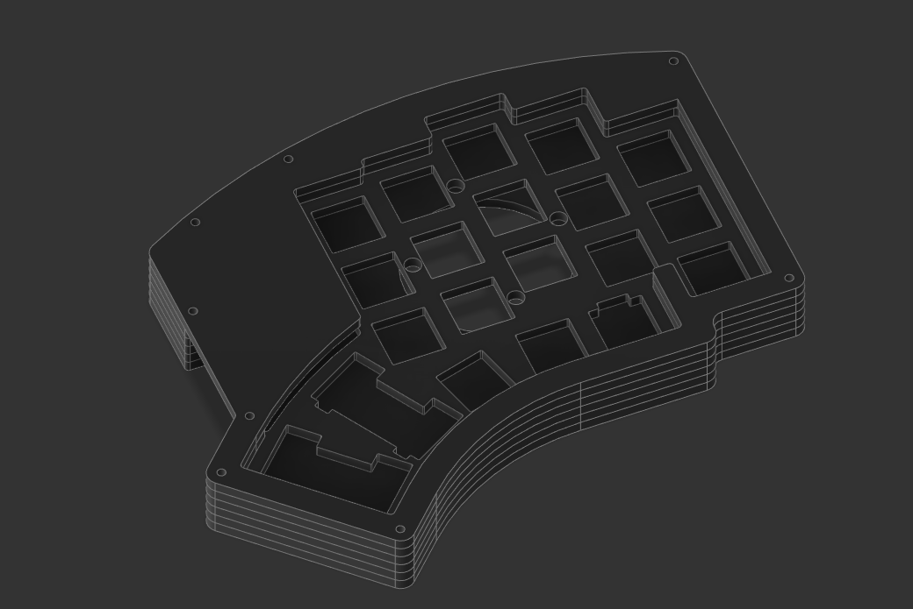

# Five Columns High Profile case

### Specs

 * 5 columns
 * 1 encoder position support
 * Puck compatible
 * 2u compatible
 * MX Only

_5 columns case with oled support_

_5 columns case with no oled support_

### Build

To make a case, you'll need to cut the following out of 3mm thick acrylic:

    2 × Bottom
    4 × Mid
    2 × Plate
    2 × Top 1
    2 × Top 2 (top2_oled if you use an oled, top2_no_oled otherwise)
    2 × Guard (only if you use the top2_oled top)

Furthermore, you'll need:

    36 × 8mm M2 machine screw
    18 × 10mm M2 round spacer
