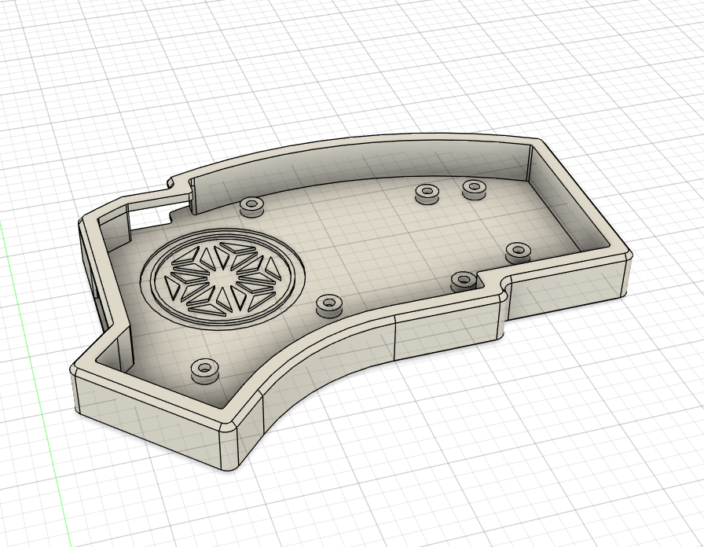
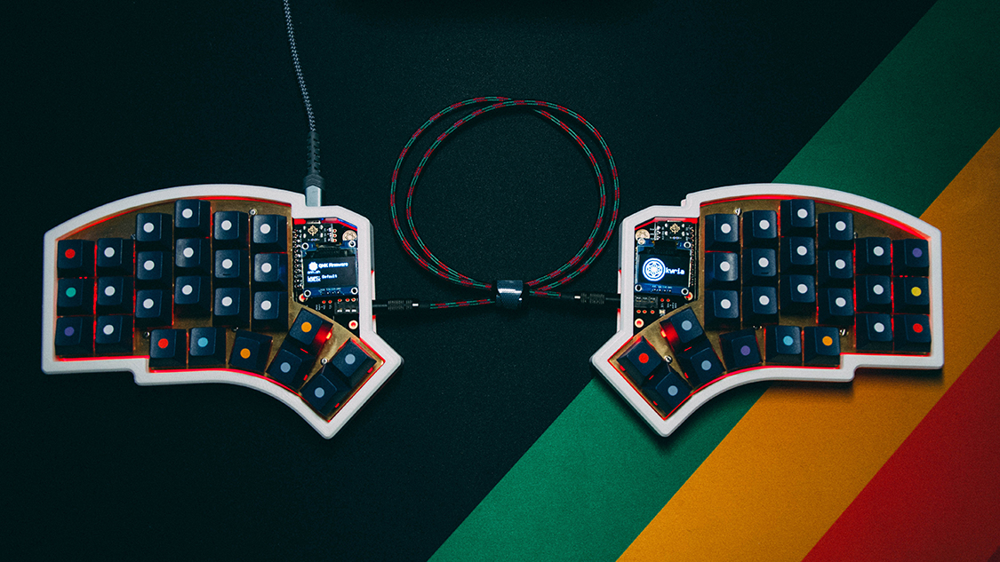
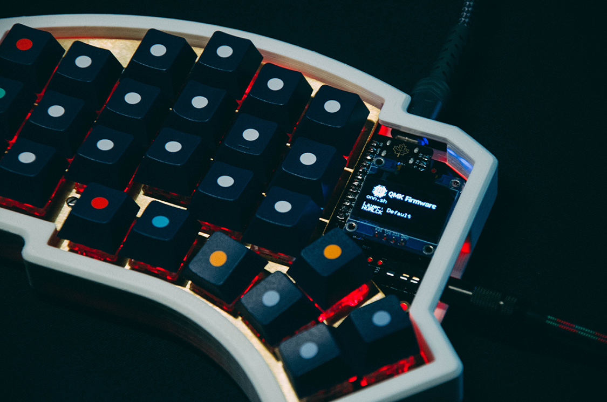

Kyria 3D Printed Case
========================

This is a 3D printed case for the Kyria, compatible with revision 0.7 - 2.1. **It is not compatible with revision 3.0 and up** - files for revision 3 will be released later.

To make a case, you'll need to print:

- left_case.stl
- right_case.stl or kyria_logo_right_case.stl

Furthermore, you'll need:

- 14 of M2 x 10mm machine screws
- 14 of M2 tapered heat-set inserts *(the ones used in the example photos below [Link](https://www.mcmaster.com/94180A312))*
- 2 x switch plates

This case is designed to work with the same sized plate as the one in the "Plate Case". A STL to 3D print a plate is provided in the case files, but a laser cut metal or acryllic plate can also be used.

## Assembly
- Heat-set inserts should be slowly pressed into each "pillar" with the tip of a soldering iron set at the same temperature as your 3D printer nozzle temperature.
- Plate/PCB are mounted to the case body with screws going through both Plate and PCB, tightening onto the top of the switch plate to hold it firmly into the case. 

**Screws should be firm but not overtightened**

## Build Photos

*Case Designed 2020 by Stephen Onnen*